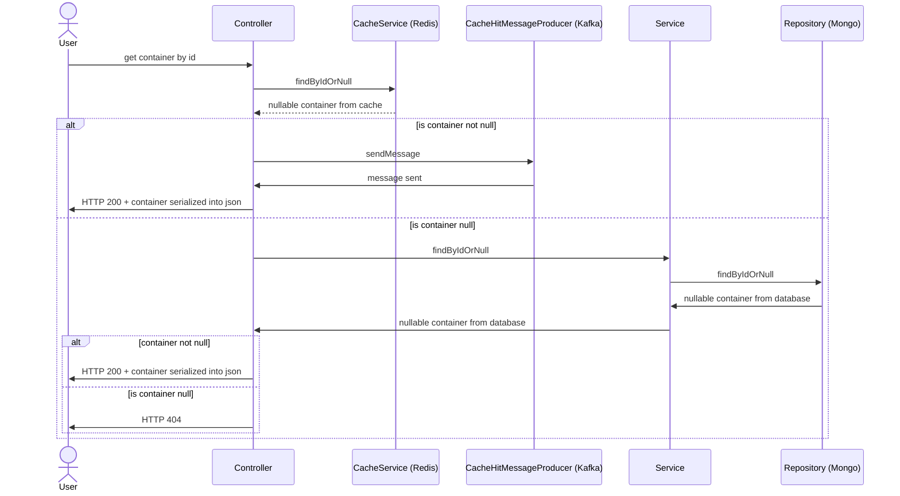

# Testcontainers

Basic introduction to using [TestContainers](https://testcontainers.com/) with Spring Boot.

* [Sample application](#sample-application)
    * [Sequence diagram](#sequence-diagram)
* [Testcontainers integration examples](#testcontainers-integration-examples)
    * [JUnit5](#junit5)
    * [Bean](#bean)
    * [ServiceConnection](#serviceconnection)
    * [Container reuse](#container-reuse)
    * [Container initialization](#container-initialization)
    * [Environment specific container](#environment-specific-container)

## Sample application

Sample application providing REST API and communicating with Mongo, Redis and Kafka.

### Sequence diagram

## Testcontainers integration examples

### [JUnit5](/src/test/kotlin/cz/gregersoftware/testcontainers/example/e1_junit5)

Simple usage of JUnit5 extension together with container annotation.

### [Bean](/src/test/kotlin/cz/gregersoftware/testcontainers/example/e2_bean)

A container as a bean. When there is a need to configure container dynamically, typically with values from Spring
properties.

### [ServiceConnection](/src/test/kotlin/cz/gregersoftware/testcontainers/example/e3_serviceconnection)

New Spring Boot 3 ConnectionDetails interface which simplify working with a connection configuration.

Note that a connection string params can be overridden (database connection string), possible solution is a custom
BeanPostProcessor.

### [Container reuse](/src/test/kotlin/cz/gregersoftware/testcontainers/example/e4_reuse)

Reusability of testcontainers between services/restarts.

### [Container initialization](/src/test/kotlin/cz/gregersoftware/testcontainers/example/e5_initialization)

A reused container reset and initialization in order to have clean environment before tests.

### [Environment specific container](/src/test/kotlin/cz/gregersoftware/testcontainers/example/e6_environment)

Different containers and their behavior for each environment (local, test, etc.) so that there are no dependencies
between them.
